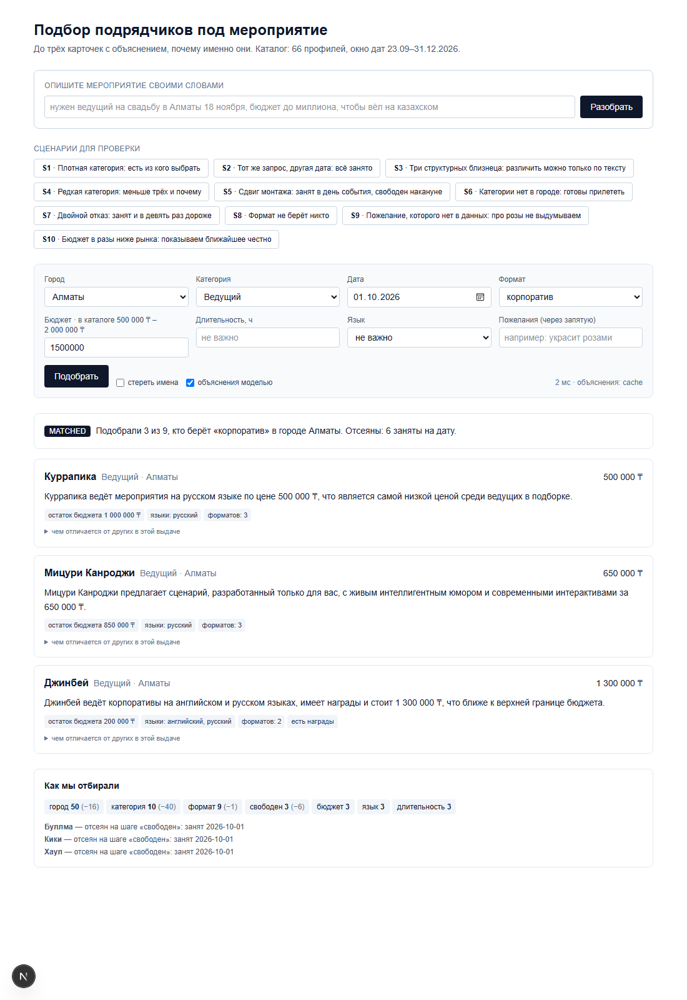
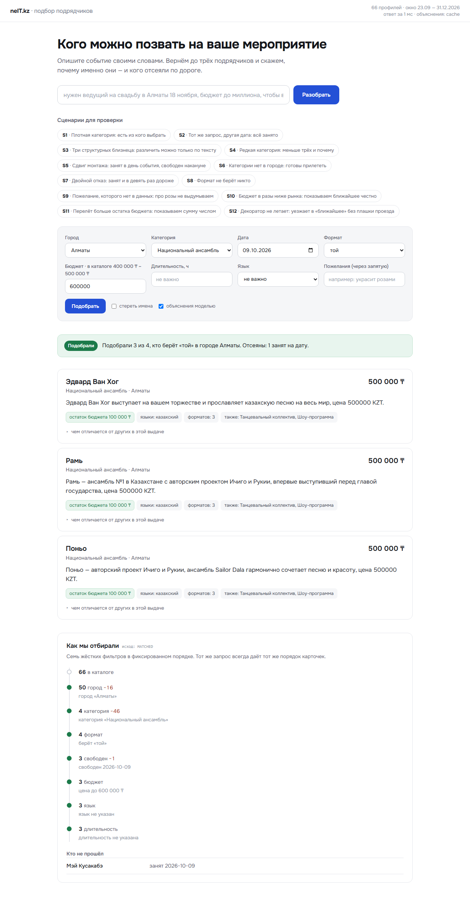
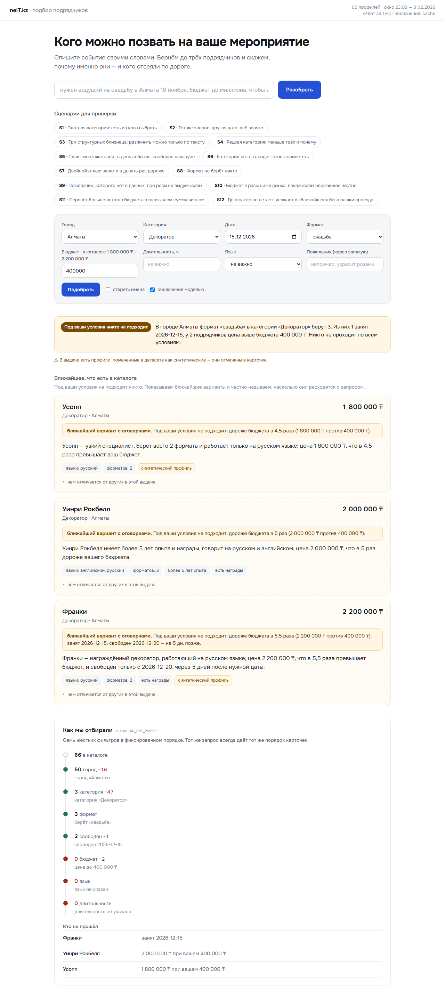
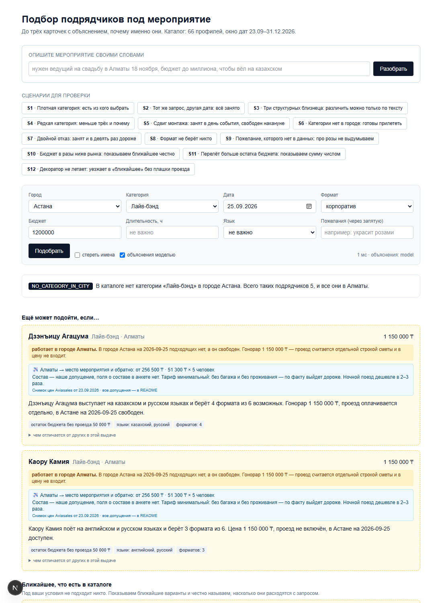

# Подбор подрядчиков под мероприятие — с объяснением, почему именно они

> Трек «Креативные индустрии» · Кейс **#79-lite «Умный подбор подрядчиков»** · HackAlem AI 2026
> Команда **neIT.kz**
>
> 🔍 **Проверить без нашего API-ключа — одна команда:** `npm ci && npm run verify`



---

## Краткое описание

**Проблема.** Заказчик получил каталог подрядчиков по своему городу и не может выбрать. Каталог не врёт,
но и не помогает: половина анкет на конкретную дату уже занята, а понять это можно только обзвоном.

**Цифры из поставленных данных** (посчитано скриптом, не на глаз):

- в среднем **занято 50 дней из 100** у каждого профиля; в декабре — 75% дней;
- при переборе 816 комбинаций «город × категория × формат × дата» **три и более подходящих подрядчика
  находятся только в 7% случаев**. В 93% запросов трёх карточек просто не существует.

**Для кого.** Клиент площадки-агрегатора, который уже выбрал город, дату и тип подрядчика.

**Решение одной фразой.** Сервис принимает параметры заказа и возвращает до трёх карточек, у каждой —
объяснение из фактов профиля, а рядом честная воронка: кого отсеяли, почему, и что можно поменять,
чтобы подходящие появились.

---

## Что реализовано

### Требования кейса

| Требование | Как закрыто | Где посмотреть |
|---|---|---|
| Вход: город, дата, тип мероприятия, категория, бюджет; опционально длительность и язык | Два входа: свободный запрос в мини-чате (`POST /api/parse`) и форма (`POST /api/match`). Бюджет необязателен: без него фильтр по цене не применяется, а в ответе появляется оговорка | [`lib/parse.ts`](lib/parse.ts), [`app/api/match/route.ts`](app/api/match/route.ts) |
| Выход: до 3 карточек с именем, категорией, городом, ценой и объяснением на 1–2 предложения | Карточки с объяснением, чипсами фактов и бейджами честности | [`lib/explain.ts`](lib/explain.ts), [`app/page.tsx`](app/page.tsx) |
| Занятый на дату не попадает в выдачу | Шаг 4 фильтра; площадки идут тем же путём, что люди | [`lib/filters.ts`](lib/filters.ts) |
| Подходящих меньше трёх — показать сколько есть и почему | Текст исхода считается **кодом** с точными числами; блок послаблений «ещё может подойти, если…»; если не проходит никто — блок «ближайшее, что есть в каталоге» с честной величиной расхождения («дороже бюджета в 4,5 раза», «свободен на 5 дней позже») | [`lib/match.ts`](lib/match.ts), [`lib/relax.ts`](lib/relax.ts) |
| Детерминизм: тот же запрос — тот же порядок | Чистые функции, округление score до 4 знаков, тай-брейк по `id`, кэш объяснений | [`lib/scoring.ts`](lib/scoring.ts) |
| Три исхода различимы явно | Исходов **четыре**: добавлен «формат не берёт никто» — в данных таких пар 47 | [`lib/types.ts`](lib/types.ts) |

### Definition of Done

| Пункт DoD | Чем закрыт | Где посмотреть |
|---|---|---|
| Ответ до 10 секунд | Ядро 0–11 мс; объяснение моделью 2–8 с; повтор — мгновенно из кэша | [`samples/report.md`](samples/report.md) |
| Объяснения не взаимозаменяемы | Различители считаются **до** обращения к модели; валидатор бракует пересечение > 0.35. Замерено на всех сценариях: **максимум 0.24** | [`lib/differentiators.ts`](lib/differentiators.ts), [`samples/report.md`](samples/report.md) |
| Повторный запуск — тот же порядок | `npm run verify` сверяет 12 сценариев с эталонами (12/12 PASS без ключа) + `npm test` — 32 теста, включая три прогона подряд на идентичность | [`samples/golden/`](samples/golden/), [`tests/core.test.ts`](tests/core.test.ts) |
| Один запрос, две даты — разный результат, и видно, что дело в занятости | S1 (01.10, 3 карточки из 9) против S2 (12.12, ноль: заняты все девять) | [`samples/golden/S1.json`](samples/golden/S1.json), [`S2.json`](samples/golden/S2.json) |
| Плотная категория на осеннюю дату | S1 «Ведущий · Алматы · корпоратив · 01.10» — в категории 15 профилей | [`samples/golden/S1.json`](samples/golden/S1.json) |
| Редкая категория | S4 «Флорист · Алматы» — в категории 3 профиля, в выдаче 1 | [`samples/golden/S4.json`](samples/golden/S4.json) |
| Запрос без результата, объяснённый словами | S2, S7, S8 — три разных типа пустоты, у каждого свой текст с числами | [`samples/golden/S7.json`](samples/golden/S7.json), [`S8.json`](samples/golden/S8.json) |
| Команда объясняет, что внутри пайплайна | Воронка отсева возвращается в каждом ответе и рисуется на экране | поле `funnel` в любом файле [`samples/golden/`](samples/golden/) |

---

## Как работает решение

Главный принцип: **решения принимает детерминированный код, модель только формулирует.**
Всё, что модель написала, проверяется кодом против фактов.

0. **Приём запроса (мини-чат)** — модель получает перечни каталога (3 города, 17 категорий, 6 форматов)
   и обязана вернуть значение **ровно из списка**, сама справляясь с падежами, регистром, опечатками
   и синонимами: «в АСтану» → Астана, «нужин вядущий на карпоратив» → Ведущий + корпоратив,
   «тамаду на тоййй» → Ведущий + той. Код затем проверяет членство в перечне, дату — на попадание
   в окно датасета, а цифры бюджета — на присутствие в тексте пользователя. Словарное сопоставление
   осталось подстраховкой и работает, когда ключа модели нет вовсе. Всё, чего в каталоге нет,
   возвращается с цитатой. Перед поиском пользователь подтверждает разбор — **поиск идёт от подтверждённой структуры,
   а не от текста**, поэтому разбор не влияет на детерминизм выдачи.
1. **Жёсткие фильтры** — семь шагов в фиксированном порядке: город → категория → формат → свободен на дату →
   бюджет → язык → длительность. Каждый шаг записывает, сколько отсеял и почему.
1а. **Семантика пожеланий** — «украсит розами», «без пошлых конкурсов» нельзя сверить со списком,
   это открытое множество. Пожелание и предложения описаний превращаются в векторы
   (`text-embedding-3-small`, сжатие до 256 измерений), и пожелание считается подтверждённым,
   если ближайшее предложение достаточно близко по смыслу. Подтверждение всегда приносит цитату
   из профиля; неподтверждённое пожелание карточка обязана назвать вслух.
2. **Ранжирование** — взвешенная сумма факторов; вес отдан тому, что **различает** кандидатов между собой,
   а не тому, по чему они прошли фильтр. Тай-брейк по `id`.
3. **Контракт фактов и различители** — код заранее находит, чем карточки отличаются друг от друга,
   и раздаёт каждой свои отличия. Три яруса: поля анкеты → уникальная фраза из описания →
   честное признание, что профили почти совпадают.
4. **Объяснения** — один вызов модели на всю выдачу, `temperature = 0`, на входе только факты.
5. **Валидатор (код, не промпт)** — числа из текста обязаны присутствовать в фактах; запрещены общие фразы;
   пересечение объяснений не выше 0.35; неподтверждённое пожелание **обязано** быть названо вслух.
   Брак → один повтор → шаблон из фактов.
6. **Послабления** — если карточек меньше трёх, отдельным блоком показываем варианты с оговоркой.

### Почему так, а не иначе

**Один вызов модели на всю выдачу, а не три отдельных.** Если писать объяснения независимо, они получаются
взаимозаменяемыми: модель не знает, чем карточка отличается от соседней. Видя все три сразу и получая
готовые различители, она пишет тексты, которые нельзя переставить местами.

**Различители считаются кодом до генерации.** В данных есть тройка национальных ансамблей с одинаковой ценой,
одинаковыми часами, одним языком и одним форматом — структурно они неразличимы. Для таких случаев есть
второй ярус: уникальная фраза из описания («впервые выступивший перед главой государства»).
И третий — честно сказать, что предложения почти совпадают, вместо выдуманного отличия.

**Воронка возвращается в API, а не только рисуется.** Она же вход для эталонных проверок и доказательство,
что фильтры делают ровно то, что заявлено.

**Кэш, а не обещание детерминизма.** `temperature = 0` не гарантирует одинаковый ответ у провайдера.
Гарантию даёт кэш по хешу «запрос + факты + версия промпта + модель». Порядок карточек от модели
не зависит вообще — его определяет код.

---

## Технологии

- **Next.js 16** (App Router), **TypeScript strict**, Tailwind CSS
- **OpenAI API**: `gpt-4.1-mini` для объяснений и разбора запроса (`temperature = 0`),
  `text-embedding-3-small` (256 измерений) для смыслового сравнения пожеланий с описаниями
- **Без базы данных**: 66 профилей лежат в репозитории как JSON — осознанное решение ради воспроизводимости
- **AI-агент разработки**: Claude Code

## Архитектура проекта

```
браузер (app/page.tsx)
  ├─ POST /api/parse        разбор свободного запроса → поля + «правильно понял?»
  │    └─ lib/parse.ts      модель раскладывает, код проверяет по словарям каталога
  └─ POST /api/match
       ├─ lib/filters.ts        7 жёстких фильтров + воронка + исход
       ├─ lib/scoring.ts        веса, факты, пожелания, тай-брейк по id
       ├─ lib/differentiators.ts чем карточки отличаются друг от друга (3 яруса)
       ├─ lib/relax.ts          послабления: дата, формат-сосед, перелёт, бюджет, часы
       ├─ lib/match.ts          сборка ответа + тексты исходов (считаются кодом)
       └─ lib/explain.ts        один вызов модели → валидатор → кэш → шаблон
data/contractors.json   66 профилей, списки нормализованы в множества
data/scenarios.json     единый источник сценариев: интерфейс, проверка, отчёт
samples/golden/         эталонные ответы на все сценарии
```

## Установка и запуск

```bash
git clone <repo> && cd hack-40ac7a06-neit-kz
npm ci
npm run verify     # проверка всех сценариев, ключ НЕ нужен
npm test           # 32 теста: детерминизм, инварианты, разбор запроса, семантика, проезд
npm run dev        # http://localhost:3000
```

**`.env.local` необязателен.** Без `OPENAI_API_KEY` сервис работает: объяснения берутся из закоммиченного
кэша, а при промахе кэша собираются шаблоном из фактов. Порядок и состав карточек при этом те же —
их определяет код, а не модель. Чтобы получать живые объяснения, впишите свой ключ:

```bash
cp .env.example .env.local   # OPENAI_API_KEY=sk-...
```

## Как проверить решение

### Путь 1 — без браузера, 30 секунд

```bash
npm run verify
```

Ожидаемый вывод:

```
PASS            S1  MATCHED              карточек 3+0+0  11 мс  (cache)
PASS            S2  NO_ONE_PASSES        карточек 0+0+3  1 мс  (cache)
PASS            S3  MATCHED              карточек 3+0+0  1 мс  (cache)
PASS            S4  MATCHED              карточек 1+0+0  1 мс  (cache)
PASS            S5  NO_ONE_PASSES        карточек 0+2+1  0 мс  (cache)
PASS            S6  NO_CATEGORY_IN_CITY  карточек 0+2+1  0 мс  (cache)
PASS            S7  NO_ONE_PASSES        карточек 0+0+3  0 мс  (cache)
PASS            S8  NO_FORMAT_IN_POOL    карточек 0+0+3  0 мс  (cache)
PASS            S9  MATCHED              карточек 2+0+0  1 мс  (cache)
PASS            S10  NO_ONE_PASSES        карточек 0+0+3  0 мс  (cache)
PASS            S11  NO_CATEGORY_IN_CITY  карточек 0+2+1  1 мс  (cache)
PASS            S12  NO_CATEGORY_IN_CITY  карточек 0+0+3  0 мс  (cache)
максимальное пересечение объяснений: 0.24 (порог 0.35)
все сценарии совпали с эталонами
```

### Путь 2 — в браузере, 2 минуты

`npm run dev` → http://localhost:3000 → кнопки-пресеты сверху:

| Нажать | Что увидите |
|---|---|
| **S1** | 3 карточки, в воронке видно, что 6 ведущих заняты 1 октября |
| **S2** | тот же запрос на 12 декабря: ноль карточек и текст «заняты все девять» |
| **S3** | три структурно одинаковых ансамбля — и три разных объяснения |
| **S5** | ноль в основной выдаче, но двое декораторов свободны накануне: монтаж сдвигается, дата мероприятия — нет |
| **S6** | лайв-бэндов в Астане нет вообще, двое готовы прилететь из Алматы |
| **S9** | «украсит розами» — в профилях роз нет, и система говорит об этом прямо |
| **S10** | бюджет 400 000 ₸ на декоратора при рынке 1,8–2,2 млн: не проходит никто, но экран не пустой — показаны ближайшие с расхождением «дороже в 4,5 раза» |
| **S11** | лайв-бэнда в Астане нет; двое готовы приехать из Алматы, и рядом стоит цена проезда — 256 500 ₸ на пятерых |
| **S12** | декоратор из другого города не предлагается как «прилетит»: он везёт конструкции, а не летит в кресле |

Проверка мини-чата (поле «Опишите мероприятие своими словами»):

| Что написать | Что произойдёт |
|---|---|
| `нужен ведущий на свадьбу в Алматы 18 ноября, бюджет до миллиона, чтобы вёл на казахском` | все поля разобраны, пожелания вынесены отдельно, кнопка «Всё верно, искать» активна |
| `хочу ведущего из Шымкента на той 5 октября за 700 тысяч` | категория, формат, дата и бюджет разобраны, а про Шымкент сказано прямо: такого города в каталоге нет. Ближайший город **не подставляется** |
| `нужен фотограф недорого` | «недорого» не считается бюджетом; система спрашивает город и дату |

Любой сценарий открывается прямой ссылкой: `http://localhost:3000/?s=S10`.

**Три исхода на скриншотах:**

| Есть из кого выбрать | Структурные близнецы | Не подходит никто |
|---|---|---|
|  |  |  |

Два тумблера рядом с кнопкой поиска:

- **«стереть имена»** — имена заменяются на «Подрядчик A/B/C». Карточки всё равно различимы: это буквальная
  проверка пункта DoD.
- **«объяснения моделью»** — выключите, и объяснения соберутся шаблоном из фактов. Состав и порядок карточек
  не изменятся: видно, что ранжирование не зависит от модели.

## Данные и интеграции

- **Каталог:** 66 анонимных профилей из поставки организаторов, без изменений. Имена вымышленные,
  реальные персональные данные не используются.
- **Своих синтетических профилей мы не добавляли.** Бейдж «синтетический профиль» отмечает те 13,
  что пришли в датасете (`HK-90001…HK-90013`), поэтому «видно, где настоящий, а где наш» выполняется точно.
- **Честность полей:** у 18 профилей цена помечена как оценочная (`price_imputed`) — среди них все банкетные
  залы, рестораны, загородные площадки и отели. В карточке стоит бейдж «цена ориентировочная».
- **Ловушки данных, которые мы учли:** порядок значений в списках не нормализован (`русский|казахский`
  и `казахский|русский` встречаются поровну) — парсим в множества; `max_hours = null` означает
  «работа не привязана к присутствию» (флорист, декоратор, сувениры — 9 профилей), и фильтр длительности
  их не отсеивает; у 25 профилей бренд в описании не совпадает с именем — модели запрещено брать имя из текста.
- **Внешние сервисы:** OpenAI API (объяснения и разбор запроса) и снимок цен на перелёты
  из Travelpayouts / Aviasales — см. раздел «Стоимость проезда» ниже. Живых вызовов в рантайме нет:
  и объяснения, и цены перелётов лежат в репозитории.

## Ограничения

- Каталог ограничен поставкой: 3 города, 17 категорий, окно дат 23.09–31.12.2026. Вне окна `busy_dates` пуст,
  и выдача неинформативна.
- Совпадение с пожеланиями ищется словарно по описаниям. Описания короткие (медиана 313 символов),
  поэтому сигнал слабый — мы предпочли честное «в профиле не упомянуто» выдуманному совпадению.
  Семантический поиск на эмбеддингах в эту версию не вошёл.
- Мини-чат разбирает запрос одним проходом: многоходового диалога с накоплением контекста нет —
  недостающее дозаполняется в форме. Разбор кэшируется в памяти процесса, а не на диске.
- Без ключа модели мини-чат не работает (об этом говорит сообщение в интерфейсе); подбор, объяснения
  из кэша и `npm run verify` при этом работают полностью.
- Бронирование, заявки и уведомления подрядчику — вне объёма кейса.
- Интерфейс минимальный: по условию кейса приоритет у качества объяснений, а не у оформления.

## Семантика пожеланий и работа без ключа

**Что делает модель, а что код.** Падежи, опечатки и синонимы разбирает модель — она получает перечни
каталога и обязана вернуть значение ровно из списка. Смысловое сравнение пожеланий с описаниями —
эмбеддинги. А решения принимает код: фильтры, ранжирование, порог подтверждения, воронка.

**Порог подтверждения — 0.42, выбран замером, а не на глаз.** Проверяли на реальных описаниях:

| Пожелание | Ближайшее по смыслу | Должно подтвердиться |
|---|---|---|
| «цветочное оформление свадьбы» | 0.566 | да |
| «ведёт на казахском языке» | 0.545 | да |
| «зал на 500 человек с парковкой» | 0.493 | да |
| «живая музыка на праздник» | 0.472 | да |
| «без пошлых конкурсов» | 0.466 | да |
| «репортажная съёмка без постановки» | 0.427 | да |
| «украсит розами» | **0.405** | **нет** — роз нет ни в одном описании |
| «нужен гипноз и фокусы» | 0.386 | нет |
| «доставка дронами» | 0.312 | нет |

Между 0.405 и 0.427 граница и проходит. Показательно, что семантика **не сломала** наш главный тест
на честность: слово «розы» в каталоге не встречается, и система по-прежнему говорит об этом прямо,
вместо того чтобы притянуть «работаем с сезонными и привозными цветами».

**Почему это не мешает проверке без ключа.** Векторы посчитаны заранее и лежат в репозитории:

- `data/embeddings.json` — 258 предложений из 66 описаний (533 КБ);
- `data/wish-embeddings.json` — векторы уже встречавшихся пожеланий, включая пожелания демо-сценариев.

Поэтому `npm run verify` у проверяющего считает ровно те же числа, что и у нас: **совпадение пожеланий
влияет на порядок карточек, и расхождение здесь сломало бы детерминизм**. Если ввести своё пожелание,
которого нет в кэше, и ключа при этом нет — система честно падает на словарное сравнение и пишет
об этом в карточке: «по словам, семантика без ключа недоступна».

Пересчитать векторы можно командой `npm run build:embeddings` — она нужна только нам, проверяющему нет.

## Стоимость проезда подрядчика из другого города

Когда в городе клиента подходящих нет, мы предлагаем подрядчика из соседнего города — и сразу
показываем, во сколько обойдётся его приезд. Без этого числа клиент не может принять решение.

**Статус: это демонстрация механики, а не подключённый источник цен.** Токена партнёрской программы
Travelpayouts у нас нет и на хакатоне мы его не получали. Цены лежат ручным снимком в `data/flights.json`
(поле `source` это фиксирует), и точные значения есть только на даты демо-сценариев — остальные дни
честно обслуживаются медианой месяца, и в карточке видно, что сработала медиана.

**Как это выглядит в полноценной реализации.** Берём токен партнёрской программы, добавляем
`npm run refresh:flights` — восемь запросов к `month-matrix` (4 месяца × 2 направления) обновляют
снимок, либо переходим на живой вызов с кэшем на несколько часов. **Врезка одна — тело
`estimateTravelCost()`, интерфейс функции не меняется**, поэтому ни правила, ни карточка,
ни тесты от этого не пострадают.

**Почему не живой вызов уже сейчас.** Помимо токена: ядро обязано быть чистой функцией без сети —
от этого зависят детерминизм и обещание «проверить без ключа одной командой», а демо на площадке
не должно зависеть от вайфая.

**Как считается.** Сумма двух разных плеч — туда и обратно — умноженная на состав. Если цены
на нужный день в снимке нет, берётся ближайший день в пределах трёх суток, затем медиана месяца;
какой вариант сработал, видно в карточке.

**Проверка проекта от этого не зависит:** `npm run verify` и `npm run dev` работают без каких-либо
токенов — снимок уже в репозитории.

**Допущения, названные прямо** (их же видит пользователь в карточке):

- состав считается по таблице: ведущий — 1 человек, лайв-бэнд — 5. Поля о составе в анкете нет,
  это наше допущение. Категория, которой в таблице нет, проезд не получает вовсе — молча посчитать
  танцевальный коллектив как одного человека хуже, чем не считать;
- тариф минимальный: без багажа (для бэнда это инструменты) и без проживания — по факту выйдет дороже;
- считаем самолёт; ночной поезд Алматы — Астана дешевле в 2–3 раза, но источника по нему у нас нет;
- предполагаем, что проезд не входит в гонорар, хотя поля об этом в анкетах нет;
- порог правила «предлагать из другого города» — гонорар от 1 млн ₸. Снижать его нельзя:
  потребовался бы состав ещё для четырёх категорий, которых в данных нет.

**Статус фичи честно:** стоимость проезда **не закрывает ни один пункт Definition of Done** —
это работа сверх требований кейса.

**Два решения, отменённых расчётом** (оставлены здесь, потому что отменённое решение с расчётом
полезнее нереализованного пункта):

- отсечка «гонорар + проезд > бюджета в 1,5 раза» недостижима на этом каталоге: правило требует
  гонорар ≤ бюджета и гонорар ≥ 1 млн, значит условие сводится к «проезд дороже 500 000 ₸» —
  вдвое выше максимума по снимку;
- сортировка по полной стоимости тождественна текущей: внутри блока у всех кандидатов одна
  категория, один состав, один город и одна дата, то есть один и тот же проезд.



## Два сценария внедрения

Решение не привязано к нашему каталогу — это надстройка над любой базой подрядчиков.
Страница **`/integration`** показывает оба способа вживую: слева макет чужой площадки
с нашим виджетом внутри, справа — код подключения.

**1. Виджет в `<iframe>` — две строки разметки.**

```html
<iframe src="https://.../embed?city=Алматы&category=Ведущий"
        style="width:420px;height:640px;border:1px solid #e2e8f0;border-radius:12px"></iframe>
```

Параметры `city`, `category`, `format`, `date` и `budget` передают то, что площадка уже знает
о клиенте. Если переданы город, категория и дата — виджет показывает подбор сразу, без вопросов.
На бэкенде площадки менять ничего не нужно.

**Виджет отдаёт результат наружу.** После подбора он шлёт родительской странице сообщение
`postMessage({type: 'podbor:match', cards, outcome, message, request})`, и площадка может показать
подборку своими средствами. На `/integration` это видно вживую: каталог слева перестраивается
и показывает подходящих с собственной кнопкой «Написать» — карточки и кнопка принадлежат площадке,
от нас приходят только данные и объяснения.

**Несколько позиций в одном запросе.** «Нужен ведущий и фотограф на свадьбу, ведущему 900 тысяч,
фотографу 300» даёт **две подборки со своими бюджетами**, а не одну усреднённую. Разбор идёт
в два прогона (`POST /api/brief`):

1. **Прогон «сколько позиций»** — модель называет только список категорий, без деталей.
2. **Прогон на каждую позицию** — свой промпт, который видит только свою категорию,
   и потому не путает бюджеты и пожелания между позициями. Позиции разбираются параллельно.

Город, дата и формат обычно общие для мероприятия: если их назвала одна позиция, остальные
наследуют — иначе пришлось бы переспрашивать одно и то же по каждому подрядчику.

Приём взят из AI-парсера CastHub (`countRoles` → разбор каждой роли отдельными вызовами):
один большой промпт на mini-модели путает поля между сущностями.

**2. Чат-бот, ведущий предварительный диалог.** Это и есть содержимое виджета (`/embed`):
бот спрашивает недостающее по одному пункту, **накапливая контекст между репликами**, и,
как только собраны город, категория и дата, сам показывает подбор с объяснениями.

```
— нужен фотограф недорого
— В каком городе? В каталоге есть Алматы, Астана и Зарубежье.
— в Алматы
— На какую дату?
— 14 ноября, на свадьбу
— Какой у вас бюджет? Если не важно — можно искать без него.
— бюджет 400 тысяч, хочу репортажную съёмку
→ Фотограф · Алматы · свадьба · 14.11.2026 · до 400 000 ₸ · пожелания: недорого, репортажная съёмка
```

Уже названное не переспрашивается. Подменить известное поле новая реплика может только если
человек назвал его прямо: «хочу репортажную съёмку» **не** превращает выбранного фотографа
в видеографа, а «нет, давай лучше видеографа» — превращает.

**3. По API для площадок со своим интерфейсом.** `POST /api/match` отдаёт карточки, воронку
отсева и тексты исходов; `POST /api/parse` разбирает свободный запрос и держит диалог —
предыдущее состояние передаётся полем `known`.

## Ценность, применимость и потенциал

Кому решение подходит, что нужно для внедрения, экономика и планы развития —
отдельным документом: **[docs/business.md](docs/business.md)**.

Коротко: это надстройка над любой базой подрядчиков — маркетплейсы услуг, свадебные порталы,
корпоративные event-агентства. Нужен только доступ к профилям через API или прямую интеграцию,
переделывать каталог не требуется. Ближайший шаг развития — админка площадки, где веса факторов
подбора и тексты промптов настраиваются под конкретный рынок без правки кода.

## Ссылка на развёрнутую версию

Не развёрнута: проект проверяется локально тремя командами выше. Вся функциональность, включая объяснения,
работает без внешних ключей за счёт закоммиченного кэша.

## Команда

- **Мади Жумабек** — архитектура решения, ядро подбора, объяснения и валидатор, README.
